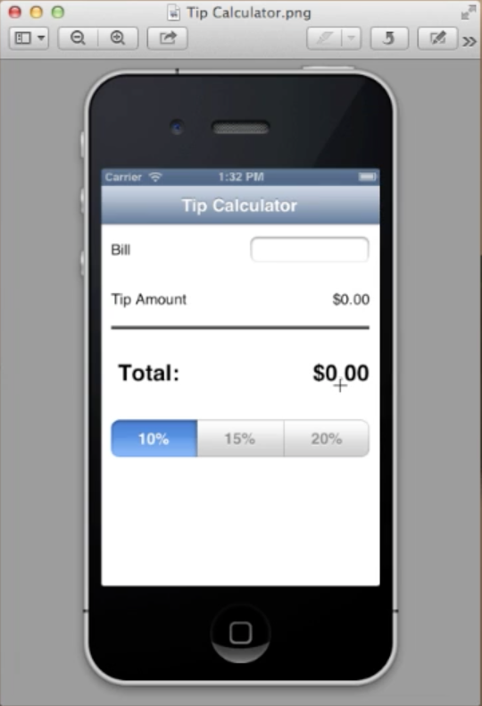

ios tip calculator
==================

This is a homework iOS app for the training class. It allows the user to enter bill amount, select a percentage of the tip, then calculates the total amount.

time spent: 1.5 hours
---------------------

screenshot
----------

screencast
----------

